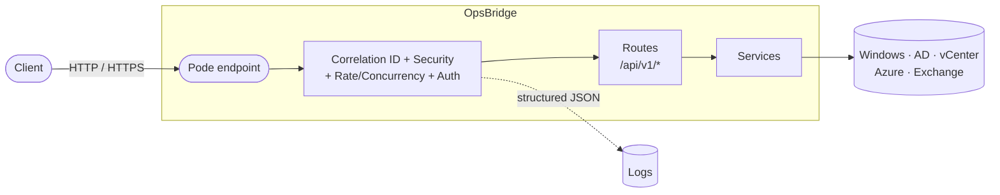

<div align="center">

# OpsBridge

**Lightweight internal REST API runtime for SysOps/DevOps automation**, built on [Pode](https://badgerati.github.io/Pode/).

[](LICENSE)
[](https://github.com/PowerShell/PowerShell)
[](https://github.com/Badgerati/Pode)
[](https://github.com/pester/Pester)

</div>

OpsBridge exposes infrastructure automation over a plain REST API (HTTP or
HTTPS). Windows today, with Active Directory, VMware vCenter, Azure and
Exchange Online planned as `/api/v1/<area>/*` additions on top of the same
pattern — REST-first, no UI dependency, one consistent way to add a new
capability. See [Target architecture](docs/architecture.md#target-architecture)
for where the transport (SSH to remote targets) and the interface (MCP) are
headed next — direction only, not implemented yet.



## Quick start

**1. Clone & run**

```powershell
git clone https://github.com/D4ri0Rookie/OpsBridge.git
cd OpsBridge
.\scripts\setup.ps1
.\server.ps1
```

**2. Try it**

```console
$ curl http://localhost:8080/health/live
{"checks":{"application":"healthy"},"status":"healthy"}

$ curl http://localhost:8080/api/v1/windows/services?name=wuauserv
{"data":[{"name":"wuauserv","displayName":"Windows Update","status":"Running","startType":"Automatic"}]}
```

**3. Or with Docker** — built on Pode's own official image, PowerShell included, nothing to install:

```bash
docker build -t opsbridge .
docker run --rm -p 8080:8080 opsbridge
```

## Why

- **HTTP or HTTPS** — same code path, `API_PROTOCOL=Https` with a self-signed cert for dev or a real `.pfx` in production
- **Structured JSON logs**, correlation ID on every request/response/log line
- **One error shape everywhere** — `{ "error": { "code", "message", "correlationId" } }`, no stack traces ever leaked to a client
- **Thin routes, real services** — automation logic has zero Pode dependency, so it's unit-testable on its own
- **Built-in hardening** — request body/rate/concurrency limits, graceful shutdown on SIGTERM, all fail-fast on bad config
- **Optional API key gate** — `API_AUTH_ENABLED=true`, off by default; health probes stay open
- **Nothing hidden** — adding an endpoint means adding a route file + a service file, not learning an internal framework

## Tests

**212 unit + integration tests passing, 0 PSScriptAnalyzer findings** (Pester 6).
Integration tests start a real server process and check the actual HTTP
contract — status codes, headers, JSON shape, correlation id — not just
isolated functions.

```powershell
Invoke-Pester -Configuration (./PesterConfiguration.ps1)
Invoke-ScriptAnalyzer -Path . -Recurse -Settings ./PSScriptAnalyzerSettings.psd1
```

**Load**: a local sanity check with `scripts/load-test.ps1` — same machine, not a network
benchmark, just proof it holds up under concurrent load with the default 3 Pode worker threads.

| Requests | Concurrency | Result | Latency (min / avg / p95 / max) |
|---|---|---|---|
| 1000 | 50 | 1000/1000 `200` | 3.3 / 16.4 / 83.9 / 280.8 ms |

```powershell
.\scripts\load-test.ps1 -TotalRequests 1000 -Concurrency 50
```

## Documentation

| | |
|---|---|
| [Architecture](docs/architecture.md) | Layers, request flow, how to add a new capability |
| [API](docs/api.md) | Endpoints, request/response contracts, error format |
| [Configuration](docs/configuration.md) | Every `API_*` environment variable |
| [Logging](docs/logging.md) | JSON log format, event taxonomy, sensitive data policy |
| [Development](docs/development.md) | Prerequisites, tests, static analysis, Docker |

## Status

Early stage. Health endpoints and two Windows capabilities
(`GET /api/v1/windows/services`, `GET /api/v1/windows/processes`) are
implemented end-to-end — route, service, unit + integration tests, docs —
following the [capability contract](docs/api.md#capability-contract) every
future integration follows. Runtime hardening (body/rate/concurrency limits,
graceful shutdown — see [configuration.md](docs/configuration.md)) is in
place. Authentication is implemented and optional (`API_AUTH_ENABLED`, off
by default — see [api.md](docs/api.md#authentication)); authorization is
still deliberately out of scope until a capability actually needs to
differentiate callers (see [architecture.md](docs/architecture.md)).

## License

MIT — see [LICENSE](LICENSE).
