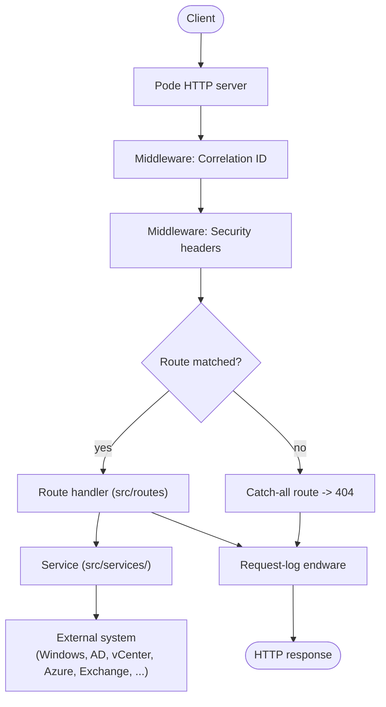

# Architecture

OpsBridge is a lightweight internal REST API runtime for SysOps/DevOps
automation, built on [Pode](https://badgerati.github.io/Pode/). Pode is the
HTTP runtime only - it does not become a general web framework here.

## Request flow



## Layer responsibilities

- **Pode** - HTTP server, lifecycle, routing dispatch, middleware pipeline.
  Configured in `server.psd1` (request timeout/body size, error page defaults)
  and started from `src/App.ps1`.
- **Middleware** (`src/middleware/`) - cross-cutting concerns only: correlation
  id, security headers, request logging. Runs in this order for every request:
  Correlation ID -> Security Headers -> (future: Authentication ->
  Authorization) -> Request Logging.
- **Routes** (`src/routes/`, `src/routes/v1/`) - thin: HTTP method + path,
  request validation, call one service function, map its result to an HTTP
  status code and body. No automation logic lives in a route file.
- **Services** (`src/services/<Area>/`) - the actual automation/business logic
  (PowerShell, SDKs, external API calls). No dependency on Pode or `$WebEvent`
  - a service function takes plain parameters and returns plain data, so it is
  unit-testable without a running server.

## Adding a new capability

Adding `GET /api/v1/vcenter/vms` should only require:

```
src/services/VCenter/Get-Vms.ps1                    # automation logic, no Pode dependency
src/routes/v1/VCenter.ps1                           # thin: validate, call service, respond
tests/unit/services/VCenter/Get-Vms.Tests.ps1       # service logic, mocked external calls
tests/integration/v1/VCenter.Tests.ps1              # real HTTP contract
```

`tests/` mirrors `src/` one level down from `unit`/`integration`: a file under
`src/middleware/`, `src/services/<Area>/` or `src/routes/v1/` gets its test at
the same relative path under `tests/unit/` or `tests/integration/`. A file
that lives directly under `src/` (`Config.ps1`, `Errors.ps1`, `Logging.ps1`)
keeps its test directly under `tests/unit/` too - see
`tests/unit/services/Windows/Get-WindowsServices.Tests.ps1` and
`tests/integration/v1/Windows.Tests.ps1` for the reference pair.

`src/services/*.ps1` files are discovered and loaded automatically
(`Register-ApplicationServices` in `src/App.ps1`); route files under
`src/routes/` and `src/routes/v1/` are discovered and loaded automatically too
(`Register-ApplicationRoutes`). Neither needs touching to add an endpoint. See
`src/routes/v1/Windows.ps1` and `src/services/Windows/Get-WindowsServices.ps1`
for the reference implementation of this pattern.

### Gotcha: no `$script:`-scoped state in a service or route file

Pode's `Use-PodeScript` propagates **function definitions** from a dot-sourced
file into every runspace it manages (web/route, middleware, timers), but it
does **not** re-run arbitrary top-level statements in each of those runspaces
- so a top-level `$script:someCache = @{...}` is only ever populated in
whichever runspace happened to dot-source the file first. A route handler
that reads that variable in a *different* runspace sees `$null`, not the
value you set - and `$null[...]`/`$null.Method()` fails at request time only,
never in a unit test (which never touches Pode's runspace pools at all).

This bit `src/logging/Logging.ps1` in exactly this way during development: a
`$script:AppLogLevelMap` lookup table worked fine when read from the startup
scriptblock, but crashed every request that called `Write-AppLog` from inside
a route handler, with `Cannot index into a null array`. Fixed by turning the
lookup into a function (`Get-AppLogLevelMap`) instead of a shared variable -
functions propagate correctly, incidental script-scope state does not.

If a new service genuinely needs state shared across requests (a cache, a
counter), use Pode's own `Get-PodeState` / `Set-PodeState` (see
`AppConfig`/`AppReady` in `src/App.ps1` for the existing pattern) - never a
bare `$script:` variable.

`tests/integration/Logging.Tests.ps1` now reads the actual log files back and
asserts their JSON matches the schema in [logging.md](logging.md) - a
regression like this one would fail that test, not just a live request.

## What is deliberately not here

- **No `repositories/`, `controllers/`, `providers/`, `factories/`, `managers/`,
  `bootstrap/`, or `routing/` layer.** Configuration, logging and error
  handling each get a dedicated folder (`src/config/`, `src/logging/`,
  `src/errors/`) with exactly one file today, the same way `src/middleware/`,
  `src/routes/` and `src/services/` are organized - a consistent, predictable
  shape, not a sign that more files are expected there. Route loading and the
  per-route error-handling wrapper still live directly in `src/App.ps1`
  rather than a dedicated "routing" package, because the loader is a handful
  of lines that only `src/App.ps1` calls - `App.ps1` itself is the one file
  that stays flat at the top of `src/`, since it is the orchestrator, not a
  concern with its own boundary.
- **No rate limiting.** Explicitly out of scope for this version - remove any
  attempt to reintroduce it without a concrete, current requirement.
- **No UI dependency.** OpsBridge is REST-first: every route under `/api/v1/*`
  and `/health/*` works with no HTML surface at all. A `/` status page may be
  added later as a pure addition, not a dependency.
- **No authentication/authorization yet.** The middleware order above already
  reserves the slot between Security Headers and Request Logging for it.

## API versioning

`/api/v1/*` is the current contract. A breaking change gets `/api/v2/*`
alongside it, not a modification of `/api/v1/*`. `/health/live` and
`/health/ready` are intentionally outside versioning - they describe the
process, not an API contract.

## Environments

The same code and the same container image run in Development, Test and
Production; only `API_ENVIRONMENT` and the other `API_*` environment variables
change (see [configuration.md](configuration.md)). Nothing in `src/` branches
on environment except through `Get-AppConfig`.
